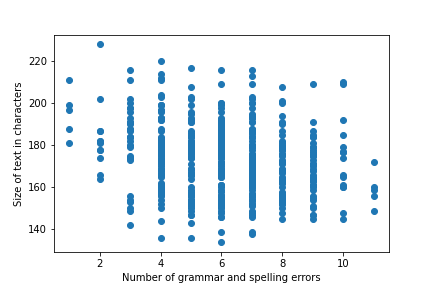

# Report by Noor Buchi

## Completed Timeline (Due by Monday, October 25 11:30am)


| Timeline  | Tasks |
| ----------- | ----------- |
|   10/27    |    Complete data collection  |
|   10/29    |    Implement Text Generation  |
|   11/01    |    Assessment of Model  |
|   11/03    |    Simple demo  |
|   11/05    |    Model Adjustments  |
|   11/08    |    Final Changes  |

## Progress Update (due on October 29 by 11:30am)

So far, I created a movie and TV show data set. Additionally, I collected and stored all the plot and synopsis for each movie and show. They are ready for the next steps which is preprocessing. I'm a little behind on the schedule but I'm planning to catch up as soon as I can.

## Data

The data used to train the ai model is the synopsis of hand selected movies and
shows. A list of the movies and shows can be found in the `dataset.yaml` file.
The items were selected based on it's genre, if a movie or a show contained
sci-fi elements such as robots, ai, time travel or other futuristic concept,
then it was included in the list. Once the list was created, I used
[IMDbPY](https://imdbpy.github.io/) to make requests and get the synopsis to
each data item. For each item the database returned multiple synopsis that were
phrased somewhat differently. All of them were kept for the purposes of training
the model. Additionally, for tv shows, the data miner iterated through every
season and episode of the show and retrieved the individual synopsis of each episode.

## Text Generation

Describe the techniques used for an automated generation of your script synopsis. Cite (provide a link to) any sources you have used. Include your generated text (or its snippet) below.

In order to train the AI model that generates the text
[aitexgen](https://github.com/minimaxir/aitextgen) was used. It makes text
generation very easy by abstracting many details that can be challenging to
implement. The training phase took about 3 hours to complete and produced a
model object where the `.generate()` function can be called on. Two similar
models were trained for this lab, the first one, stored in
`model with shows/my_model.pkl` includes fewer movies but also contains the 3
listed shows in `dataset.yaml`. The second one, however, only contains the
movies listed in the dataset. This was done after noticing that the data
collected from the shows sometimes overwhelmed the generated output due to it's
over representation. To use these models, they can be uploaded to Google Colab
in addition to `generator.ipynb`. The last section contains code to deserialize
and use the stored model.

The most accurate and meaningful generated text by the technique I used is
listed here. It's a mixture of strings generated at different phases with some
minimal reformatting and small fixes. The text is:

```
It starts with world; Dolores has trouble separating her dreams from reality; The Man in Black looks to the past.
Bernard discusses with Dr. Ford asking why he forced him to kill his beloved
Theresa. Dolores and Bernard reconnect with their pasts. Delos, Charlotte prambles to protect Delos' most prized asset; Bernard gets closer to the truth.
An enigmatic figure becomes the centre of Delos' secret project; The Man in
Black and Lawrence follow the clues.
```

Other generated text is also listed below. Although it's not
coherent and contains many mistakes, it's interesting and sometimes funny. Here
are some honorable mentions:

```
In a world of the monolith, beneath the surface of the planet in a mission to evolution, Sometime in the earthlings have moved to Saturn's moon Titor.
==========
After the Artificial Intelligence, working to create a sentient machine that
combines the hosting. Sarah Conrings are under suspected. The Man in
Black seeks help from a conddemn
==========
before the numbing in the world.
PA young, Imperial Foster must discover the new programmer at the first of the planet in the fate of the diplity and Earth has become cosuring everyolonized that yet import
==========
when a resistance against the machines, conquertects, Smperor --Kyle coper's son embark on a question - even embles who will stop at him to exploit the fate of space.
==========
thoughts working ged by law enforcing robot capable against the Death Star
before it can annihilate all hope of restoring freedom to the galaxy.
==========
```

## Text Analysis

Text analysis was done with the help of
[language-tool-python](https://pypi.org/project/language-tool-python/), which
detects grammatical and spelling errors in english text. While there are some
concerns about the accuracy of the tool, it's very easy and simple to use, thus
it was picked.

It's not clear how consistent this output is for different runs of the same
model, however, at the time where the analysis was run, this was the output.



```
Error frequency: 28.78592764686359 characters per error
```


## Experimental Analysis

To analyze the data, the following steps were taken:

First, the selected model was deserialized and stored. Then the model was used
to generate 500 outputs. Due to the way the model's API works, the output is
directly printed to the console rather than stored in a variable. To fix that
issue, stdout was read, stored, split, and filtered resulting in a list of
generated texts from the model.

Once the generation step was completed, a loop iterates through the list of
inputs and finds the number of errors. Additionally, it stores the number of
errors and length of input in a list of tuples. Following that, the data is
graphed in a scatter plot and used to calculate an average by adding up all the
lengths and dividing it by the sum of errors.

## Supplemental Production

The supplemental production is a collage of all the movie/show posters and
promotional material created as a background to some of the generated text as a
quote. Overall, it shows how combining material and data from the large and
diverse dataset can produce some interesting output.

TODO: add image here

## Challenges and Learning Experiences

There were many challenges throughout this lab. At the beginning, it was
gathering the needed data and organizing it in a parsable format. IMDbPY had
some documentation but it was still challenging to underhand and use. Once that
challenge was overcome, training the AI model was the next big challenge, at
first, tensorflow was directly used to complete the task but I encountered many
errors. To avoid the issues there, aitextgen was then used. Aside from the long
time to train the model, it worked really well and generated some output.

Some learning experiences in this lab include training a text generation AI
model and fixing the errors along the way. Additionally, keeping data organized
and accessible was another learning experience in this lab.

## Ethical Benefits and Implications

If you are unable to discern specific themes related to future technology use from your synopsis, provide a manually edited version of your synopsis below.

```
(Optional) Modified Synopsis
```

Then, hypothesizing on the issues highlighted in your generated (or modified) text, answer the following questions.

1. What future technology is featured in your synopsis?

The synopsis is very ambiguous and in what it refers to. However, it could be
refers to separating dreams from reality and a most prized asset, both of which
could be referring to a futuristic technology.

2. What are the potential social implications and/or ethical issues and/or regulatory challenges with this technology?

It's not really clear, however, a technology that prevents people's ability to
separate dreams from reality could be very dangerous. It could essentially
create a false reality for people to live in while ignoring actual reality.

3. What do you think might be a cautionary tale related to this technology?

This somewhat draws similarities to The Matrix, where some people are trapped in
a false reality and they can chose to escape it or live there forever.

4. What fictional person in the future could best illustrate this caution?

Neo, from the matrix could illustrate this well

5. What is their story?

They must convince people stuck in their dreams to wake up and overthrow the
tyrannical government responsible for putting them in this false reality. In the
process, mysteries and drama arise as the main character gets too connected to
the false reality.

6. Now, consider what benefit can come out of the  technology featured in the story and how can we work towards preventing the negative consequences of the future they envision?

One of the benefits is to create a creative world where anything is possible,
which allows people to have awesome experiences. To avoid the deterioration of
this technology and it's possible harmful use, users must be responsible and not
overuse it to prevent getting trapped in a false reality.
